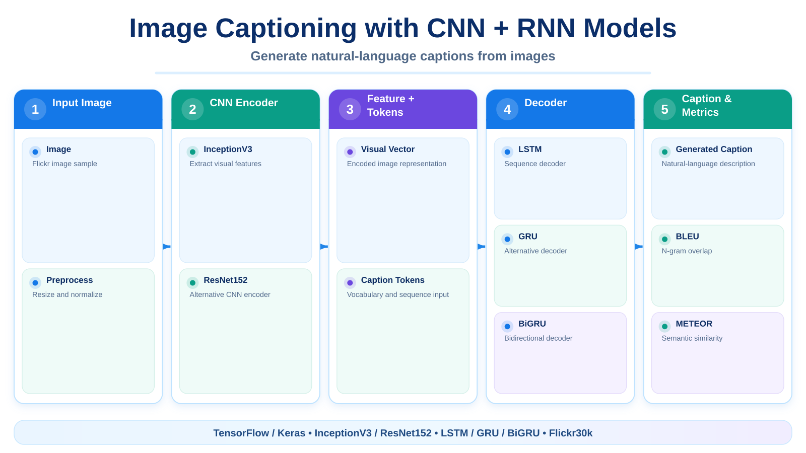

# 🖼️ Image Captioning with CNN + RNN Models

> A deep-learning project that combines **Computer Vision** and **Natural Language Processing** to automatically generate natural-language captions for images.

\n  \n
\n
---

## 📌 Introduction

Image_captioning contains a collection of Jupyter Notebook experiments for image-caption generation on Flickr datasets.

The project explores several combinations of image feature extractors and sequence decoders, including:

- InceptionV3 + LSTM
- ResNet152 + GRU
- ResNet152 + BiGRU
- ResNet152 + ELECTRA-based language features + GRU

The goal is to compare multiple encoder-decoder architectures using the same image-captioning problem and evaluate generated captions with standard NLP metrics.

---

## 🚀 Key Features

- 🖼️ Extract visual features from images using pretrained CNN backbones.
- 🧠 Generate captions with LSTM / GRU / BiGRU decoders.
- 🔤 Prepare and clean caption text.
- 📚 Build vocabularies and sequence datasets.
- 🎯 Train image-to-text encoder/decoder models.
- 📊 Evaluate generated captions using BLEU and METEOR.
- 🔬 Compare several model architectures in separate notebooks.
- 💾 Store trained-model links under Run_model/.

---

## 🏗️ Image Captioning Pipeline

~~~text
Input Image
    │
    ▼
CNN Feature Extractor
InceptionV3 / ResNet152
    │
    ▼
Visual Feature Vector
    │
    ├─────────────┐
    │             │
Caption Tokens    │
    │             │
    ▼             ▼
Embedding     Decoder
             LSTM / GRU / BiGRU
                 │
                 ▼
        Next-word Prediction
                 │
                 ▼
        Generated Caption
                 │
                 ▼
          BLEU / METEOR
~~~

---

## 🧠 Experiments in the Repository

| Notebook | Main Architecture |
|---|---|
| Image_captioning_InceptionV3_LSTM.ipynb | InceptionV3 + LSTM |
| Image-captioning_CNN-LSTM-8K.ipynb | CNN + LSTM |
| Image-captioning-resnet152(CNN)-GRU.ipynb | ResNet152 + GRU |
| Image-captioning-Resnet152-BiGRU.ipynb | ResNet152 + BiGRU |
| Image-captioning-Resnet152-Electra-GRzU.ipynb | ResNet152 + ELECTRA + GRU |

---

## 📂 Dataset

The main experiments use **Flickr30k**.

- 🖼️ 31,783 images.
- 📝 5 human-written captions per image.
- 🌍 Images cover people, animals, activities and real-world scenes.

The project notes use a split similar to:

| Dataset | Images |
|---|---:|
| Train | 25,110 |
| Validation | 6,356 |
| Test | 317 |

Some notebooks also contain experiments on smaller Flickr-style subsets.

---

## 📊 Example Results

The repository records the following example metrics for three decoder variants:

| Metric | CNN + LSTM | CNN + GRU | CNN + BiGRU |
|---|---:|---:|---:|
| BLEU-1 | **0.6054** | 0.5880 | 0.5873 |
| BLEU-2 | 0.3697 | **0.4053** | 0.3697 |
| BLEU-3 | 0.2586 | **0.3247** | 0.2415 |
| BLEU-4 | 0.1704 | **0.2761** | 0.1614 |
| METEOR | 0.3565 | **0.4010** | 0.4004 |

> These numbers are experiment results stored in the project documentation and depend on the exact dataset split, preprocessing, checkpoint and training configuration.

---

## 🛠️ Technologies Used

- 🐍 Python
- 📓 Jupyter Notebook / Kaggle
- 🔥 TensorFlow / Keras
- 🖼️ InceptionV3 / ResNet152
- 🔄 LSTM / GRU / BiGRU
- 🔤 ELECTRA experiment
- 📊 NumPy / Pandas / Matplotlib
- 🖼️ Pillow
- 📏 BLEU / METEOR evaluation

---

## 📂 Project Structure

~~~text
Image_captioning/
├── Note_book/
│   ├── Image_captioning_InceptionV3_LSTM.ipynb
│   ├── Image-captioning_CNN-LSTM-8K.ipynb
│   ├── Image-captioning-resnet152(CNN)-GRU.ipynb
│   ├── Image-captioning-Resnet152-BiGRU.ipynb
│   └── Image-captioning-Resnet152-Electra-GRzU.ipynb
├── Run_model/
│   └── link_model.txt
└── README.md
~~~

---

## ▶️ How to Run

### 1. Clone repository

~~~bash
git clone https://github.com/tttiuem2k3/Image_captioning.git
cd Image_captioning
~~~

### 2. Open a notebook

Run the selected notebook on:

- Kaggle
- Google Colab
- Jupyter with a configured GPU environment

### 3. Prepare Flickr data

Update the image/caption paths in the notebook to match your local/Kaggle dataset location.

### 4. Run cells in order

The notebooks contain preprocessing, feature extraction, training, inference and evaluation logic. Run them sequentially because later cells depend on artifacts produced earlier.

---

## 🔬 Research Direction

This repository is useful for comparing:

- Different CNN image encoders.
- Recurrent decoder architectures.
- Sequence-generation quality.
- Vocabulary/text preprocessing choices.
- The effect of richer language representations on caption generation.

---

## 🚀 Future Development

- Add Transformer-based decoders.
- Compare Vision Transformer/CLIP-style encoders.
- Centralize preprocessing into reusable Python modules.
- Add reproducible dependency/environment files.
- Export checkpoints and an inference API/demo application.

---

## 📞 Contact

- 📧 Email: tttiuem2k3@gmail.com
- 👥 LinkedIn: [Thịnh Trần](https://www.linkedin.com/in/thinh-tran-04122k3/)
- 💬 Zalo / Phone: +84 329966939 | +84 336639775

---
